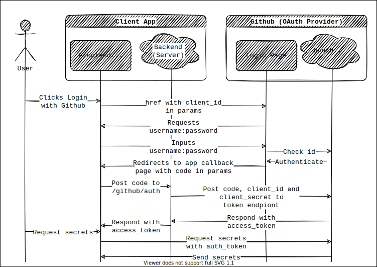

# Securing apps with OAuth2

## What is OAuth2?

OAuth2 is a workflow by which a user (know as the **resource owner**) can authorize a third party app (the **client app**) to access their protected resources hosted on a separate server (the **OAuth provider**).

Imagine you host your files with a company called *Cloudbox*. Then, you download an app called *sArCaSmR* which promises to go through your files and replace the text with sArCaSm cAsE. You obviously think this is a great idea. If Cloudbox offers OAuth, then you can enable sArCaSmR to do this without giving sArCaSmR your Cloudbox password! Instead, you obtain a token for sArCaSmR and they use that instead.

## OAuth2 Workflows

There are several different workflows. The most common are the **authorization code** workflow and the **implicit grant** workflow. The implicit grant workflow is used when the client app is serverless, and so the token is sent directly to the client app's frontend. This is simple but not secure.

The authorization code workflow is more complex but more secure, and uses server-to-server communication over https to keep everything safe.

There are several concepts covered here:
 - The **client_id** is a string which is not private. It is issued by the OAuth provider and allows the provider to know which app is requesting access.
 - Optionally, the client can send a **state** param: this is a random string which is returned by the provider to prove that the response comes from the provider.
 - After the owner authenticates, the **code** (authorization code) is a string which is passed back to the client app's callback url. This code must be included when the client app requests a token to prove that they are the ones authorized by the owner.
 - The client app must also send a **client_secret** to prove that they really are the registered app. This prevents attacks where the code is intercepted.
 - The client app should also send **scopes** - this is a list of permissions the client app would like to have, and the user will be informed of these at the time of authenticating with the provider.
 - The **authorization token** is most often a jwt, but not always. The client app can use this until it expires or is revoked by the owner or the provider.
 - Sometimes, a **refresh token** can be requested.
 - Sometimes, an **id token** can be requested as part of an **Open ID Connect** request (we'll cover this later).

 ## Getting authorized with GitHub

We will work together to write a client app which requests access to a user's private gists in GitHub. We will use the authorization code flow. (GitHub does not offer implicit grant.)

## Assignment: Getting authorized with Google

Go through the steps to get authorized with Google, and build an app similar to the GitHub example. You can use the [Google documentation](https://developers.google.com/identity/protocols/oauth2) to help.

You should follow the instructions for server-side web apps. Since we're learning, **don't** use the client library `googleapis` - you should follow the HTTP/REST instructions. This will help you to understand the flow without obscuring away the details. (We will look at using libraries later.)

Once you've managed to get a basic flow together, go ahead and build an app around Google's API. It can do whatever you want it to do - get creative!

## Extension

Strengthen your security by including a **state** param when you redirect to Google's login page. The OAuth server will include the state param in its response - you should check that it is the same one you sent!
